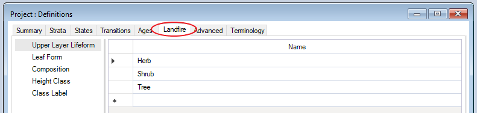
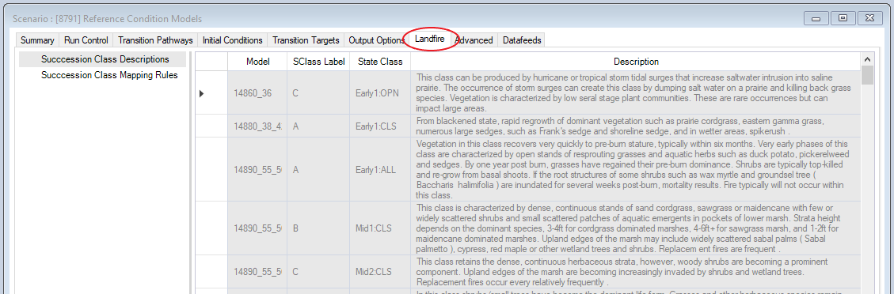

# Getting started with **landfirevegmodels**

## Quickstart Tutorial

1. Download and install SyncroSim 2.2.19 or later from [https://syncrosim.com/download/](https://syncrosim.com/download/)
 
 
2. Install necessary packages in SyncroSim by going to **File \| Packages \| Install...**
  * ST-Sim 3.2.21 or later
  * landfirevegmodels
 
 
3. If you need to update package versions, in SyncroSim go to **File \| Packages \| Update...**
 
 
4. Create a new *landfirevegmodels* Library
* In SyncroSim, select **File \| New Library...**
* Select the *landfirevegmodels* base package and choose either the *Reference Models* or *Example Models* template library.
* Enter a **Filename** (ok to keep the default) and a **Folder** for your new library and click **OK**.
* A download window should appear and your library will be created from an online template.
 
 
5. Right-click on the Project datafeed (**Definitions**) and select **Properties**. After installing the *landfirevegmodels* package, there should now be a **Landfire** tab here. In this tab you can specify the details about the quantity, type, and composition of the vegetation for your model.
 

 
 
6. Right-click on the Scenario datafeed and select **Properties**. There should now be a **Landfire** tab here as well. This tab provides information about the models, including detailed *Succession Class Descriptions* and *Succession Class Mapping Rules*.
 

 
 
7. For more documentation on the SyncroSim user interface see: [http://docs.syncrosim.com/getting_started/quickstart.html](http://docs.syncrosim.com/getting_started/quickstart.html)
 
 
8. *landfirevegmodels* is a wrapper for the ST-Sim package for SyncroSim. For more information on ST-Sim see: [http://docs.stsim.net/](http://docs.stsim.net/)
