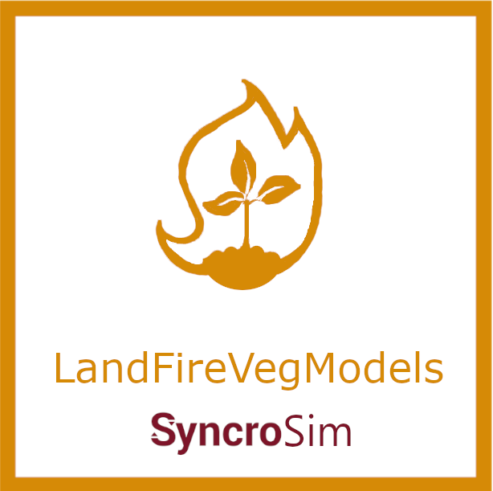

# **landfirevegmodels** SyncroSim Package

    <a href="https://github.com/ApexRMS/landfirevegmodels">
 
## Vegetation dynamics modelling framework
### *landfirevegmodels* is a SyncroSim base package to deliver LANDFIRE STSM vegetation models. It is a wrapper for the [ST-Sim](http://docs.stsim.net/) package in SyncroSim.

The *landfirevegmodels* package contains hundreds of State and Transition Simulation Models of Biophysical Settings (BpS), designed by The Nature Conservancy's LANDFIRE program in collaboration with experts across the United States. These BpS models are reference condition models depicting what ecosystems may have looked like prior to European colonization of North America. The purpose of the *landfirevegmodels* package is to provide baseline models that can be modified to represent current landscapes and used to forecast the effects of ecosystem disturbances and/or management actions through simulations.

For more information on how these types of models can be used for assessing the state of the current landscape, as well as planning for management action based on simulated future landscapes, see [Blankenship et al., 2021](https://esajournals.onlinelibrary.wiley.com/doi/10.1002/ecs2.3484).
 
 
## Requirements

This package requires SyncroSim [2.2.27](https://syncrosim.com/download/).
 
 
## How to Install

Open SyncroSim and select **File -> Packages… -> Install…**, then select the **landfirevegmodels** package and click OK.

Alternatively, download [the latest release from Github](https://github.com/ApexRMS/landfirevegmodels/releases/). Open SyncroSim and navigate to packages, then install from file.
 
 
## Getting Started

For more information on **landfirevegmodels**, including a Quickstart Tutorial, see the [Getting Started](https://apexrms.github.io/landfirevegmodels/getting_started.html) page.
 
 
## Links

Browse source code at
[http://github.com/ApexRMS/landfirevegmodels/](http://github.com/ApexRMS/landfirevegmodels/)
 
Report a bug at
[http://github.com/ApexRMS/landfirevegmodels/issues](http://github.com/ApexRMS/landfirevegmodels/issues)
 
 
Visit The Nature Conservancy's LANDFIRE site at
[https://thenatureconservancy.github.io/landfiremodels/](https://thenatureconservancy.github.io/landfiremodels/)
 
 
Read the accompanying scientific publication at
[https://esajournals.onlinelibrary.wiley.com/doi/10.1002/ecs2.3484](https://esajournals.onlinelibrary.wiley.com/doi/10.1002/ecs2.3484)
 
 
## Developers

Leonardo Frid (Author, maintainer) 
 
Alex Embrey (Author)
